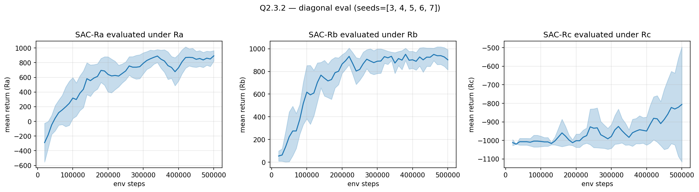
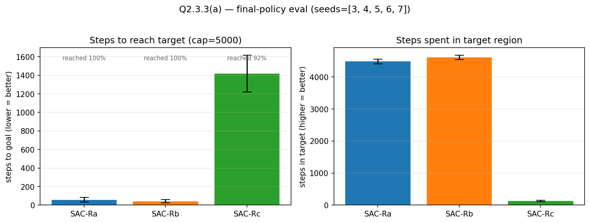
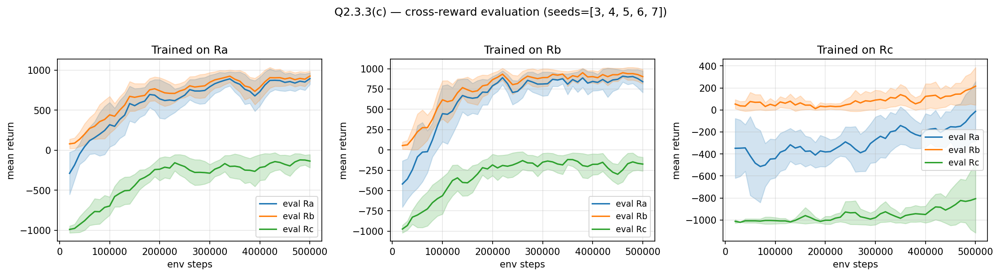
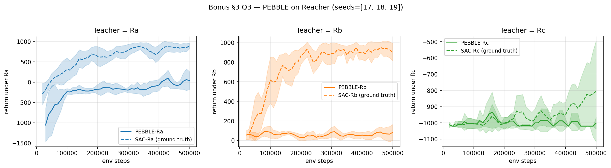

# 2.1 Pendulum

1. Design and write appropriate reward function

- An effective reward function for the modified Pendulum environment is based on the cosine of the angular error between the current angle ( \theta ) and the target angle ( \theta_{target} ). It can be defined as:

[r_t = \cos(\theta_t - \theta_{target})]

This reward is maximized when the pendulum is exactly at the target angle (i.e., ( \theta_t = \theta_{target} ), giving reward = 1), and decreases smoothly as the deviation increases. The cosine formulation naturally captures the circular nature of angles and avoids discontinuities at ( \pm 180^\circ ).

To improve control behavior, a small penalty on angular velocity and control effort can be added:

[r_t = \cos(\theta_t - \theta_{target}) - 0.1*\dot{\theta}_t^2]

where ( \dot{\theta}_t ) is angular velocity 

This reward encourages the agent to:

1. Reach the desired angle (via cosine term),
2. Stabilize at that position (penalizing velocity),

Thus, the cosine-based reward is smooth, bounded, and well-suited for learning stable target alignment behavior.

2. The code

3. From the plot, the learning speed and final performance vary noticeably across target angles.

**Learning speed:**

* Targets like (theta = -150, 10, 120, 0) learn the fastest. They show rapid improvement and reach high returns early (≈40K steps).
* **Moderate angles** such as 30 and -60 learn more gradually, with steady but slower improvement.
* **Harder targets** like 90 and -90 initially struggle (sharp drop around 20K steps), indicating exploration difficulty before recovering.

**Final performance (quality of behavior):**

* **Best performance** is achieved by ( theta = -150 ), which consistently attains the highest returns (~950+), indicating very stable alignment.
* ( theta = -10) and (0) also achieve high returns (~800), showing good convergence to the target.
* ( 120) reaches moderately high performance (~750) but with less improvement over time.
* ( 30) achieves moderate returns (~550–600), indicating partial success.
* **Lowest performance** is seen for ( -60), ( 90 ), and ( -90) (~300–400), suggesting difficulty in stabilizing at these angles.

**Overall interpretation:**
Learning is faster and more stable for targets closer to the natural upright/downward equilibrium or those easier to reach via pendulum dynamics. Targets such as ±90 are harder because they correspond to dynamically unstable points where gravity induces maximum deviation, requiring continuous and precise torque to counteract it. This leads to high sensitivity to errors, amplification of small deviations, sparse and difficult exploration trajectories, and noisy learning signals—collectively making both control and learning significantly more challenging.

4. Optimal behavior consists of two aspects:

1. Swing-up phase (energy shaping):
The agent first injects energy to move the pendulum toward the target angle, often using oscillatory motion to build sufficient momentum.

2. Approximate stabilization / limit-cycle behavior:
For closer to stable points like theta = 0, -10,1-150 it stabilises and stays at some slight deviation from the target.
For most larger angles, instead of perfectly holding the target angle, the agent often:
- oscillates around the target, or
- settles at a nearby easier-to-maintain angle (e.g., ~140° for a 120° target)

This happens because for difficult targets, maintaining the exact angle requires continuous precise torque, so the agent prefers stable or quasi-stable behaviors (oscillations or shifted equilibria) that still yield reasonably high reward.

This is reflected in the following visualizations of the system for theta target = -10 and 90 degrees - https://drive.google.com/drive/folders/1ux6DAtJJqaZ-ZaceHcT3RbjIQQfjiK6e?usp=sharing

5. 
(a) — Manual vs. automated α

We swept manual α values for each θ_target ∈ {−60, 90, 120, −150}. The candidate values were chosen by inspecting the final 5–6 values of the auto-tuned α from the corresponding Q2.1.2 runs (the values α settles to in the last 10–20K env steps), and then refining around them. The final αmnl values for every angle are:

θ_target	αmnl
−60     	0.01
90	        0.015
120	        0.005
−150	    0.005

Difficulty of tuning: Tuning α manually was moderately difficult: the optimal αmnl differed across target angles so a single value did not transfer. Looking at the auto-α trajectories was a useful prior.

Manual vs. auto comparison: Across θ ∈ {90, 120, −150}, the manual αmnl (dashed lines) achieves comparable or higher final return than auto (solid lines) and noticeably tighter confidence bands — i.e., better final convergence and lower variance across seeds. The trade-off is that manual tuning required a per-θ sweep to find these values, whereas auto-α produced reasonable performance out of the box for all four targets.

The exception is θ = −60: here auto-α slightly outperforms the best αmnl from our sweep. This is consistent with auto-α not stabilising during training for this target — the entropy requirement appears to shift over the course of learning, so any fixed α from the sweep is suboptimal for at least part of training, while the auto adjustment can adapt. This itself illustrates a limitation of manual tuning: when the optimal entropy temperature is non-stationary, a single scalar cannot match the adaptive scheme.

(b)

For scaling = 0.1, both methods reach the same asymptotic return (~+30, equivalent to the +300 from c=1). Manual is slightly tighter; auto shows a small mid-training dip (~step 30k) but recovers. 
For scaling = 10, manual converges to ≈+3200 (equivalent to +320 unscaled) by step 10k and stays there with moderate variance. Auto α breaks down: returns crash to ≈ −1100 around step 30k before partially recovering by step 50k. The variance band is huge throughout training.

SAC objective J = E[Σ (r − α · log π(a|s))]

Fixed (manual) α: the entropy term is unchanged, but the reward signal grows/shrinks by c. For c = 10, the reward dominates a fixed α = 0.015, so the policy quickly becomes near-deterministic on a good action — same behaviour as the c = 1 case but reached faster. For c = 0.1, the entropy term is now relatively larger, so the policy stays a bit more exploratory but still converges.

Automated α: the dual update on α is driven by the current entropy of the policy relative to the target entropy. The actor and critic gradients, however, scale linearly with c. So with c = 10 the critic Q-values and actor losses are 10× larger, but the α-loss is unchanged in magnitude — the optimiser pushes the policy toward determinism faster than α can compensate, the entropy collapses, learning becomes unstable, α has to ramp up by 10× to catch up, and we get the large mid-training dip and high variance that the plot shows. For c = 0.1 the opposite happens but it's gentler, because the policy is already near-deterministic and a slightly larger relative entropy term doesn't hurt.

Manual α adapts well to both scales because αmnl was already in a robust regime. Auto α adapts well to c = 0.1 but is fragile to c = 10 -  auto-α is not invariant to reward scale, and is one motivation for using a fixed manually-tuned α when the reward magnitude is known and stable.

# BONUS

1. 
Structure - 
- SAC trains on a k-NN state-entropy intrinsic reward (k = 5, rolling buffer of 10 000 states) — no teacher queries.
- Preference-based training (steps 9 000 → 50 000): every 5 000 env steps a feedback session runs.
- Reward learning. Each ensemble member is an MLP r_ψ(s, a) (256-hidden × 3-deep, Tanh) trained with the Bradley–Terry preference loss for 50 epochs over the preference buffer at every session.
- Budget. We used a total feedback budget of 1000 preference queries (≈ 50 sessions × 20 queries). 
- Following the PEBBLE paper, we used unsup_steps = 9000. On Pendulum's 3-dim state, this is likely longer than necessary; reducing it would shorten PEBBLE's startup lag without changing the asymptotic comparison.

Comparison vs. SAC trained on the ground-truth reward. 

θ = −60: Both methods plateau near +200 by step 40 K. PEBBLE is slightly lower at convergence (≈ +170) than SAC(≈ +260) but the bands overlap throughout
θ = 90: SAC reaches ≈ +320 by step 10 K but exhibits a large mid-training dip. PEBBLE rises more gradually but reaches the same ≈ +320 plateau by step 30 K, with tighter variance.
θ = 120: SAC reaches ≈ +700 by step 10 K; PEBBLE catches up by step 40–50 K. Final returns are within ≈ 50 of each other (~+760 vs ~+710).
θ = −150: SAC reaches its asymptote (~+960) by step 10 K; PEBBLE catches up by step 30 K. Final performance is identical.
θ = 0: PEBBLE converges to same value as SAC (~600) but with more variance and much slower (SAC converges after 30k steps only)

Learning efficiency: SAC is uniformly more sample-efficient: it has access to per-step reward signal from step 0, whereas PEBBLE spends steps 0–9 K on unsupervised pre-training (no task signal at all) and another ~10 K steps building up enough preference labels for the reward model to be accurate. The visible "lag" in the orange curve (typically 10–20 K env steps behind SAC) is the cost of replacing the reward function with 1 000 preference labels.

Final performance: Despite the slower start, PEBBLE matches SAC-GT's final return at every target except a small shortfall at θ = 120 and a within-noise gap at θ = −60. This is the key empirical takeaway: with only 1000 binary preference queries — and no access to the analytical reward function — PEBBLE recovers a reward representation that yields essentially the same converged policy as training directly on the true reward.

Conclusion: PEBBLE is less sample-efficient than ground-truth SAC (≈ 10–20 K-step lag, attributable to unsupervised pre-training and the warm-up of the reward model), but recovers comparable final performance across all target angles. This validates preference-based reward learning as a viable substitute when designing or specifying the reward is hard or impossible — at the cost of a modest amount of additional environment interaction.

2. 

We ran PEBBLE on θ ∈ {0, 90} for three preference-query budgets — fb ∈ {500, 1000, 2000} — keeping all other settings identical to Q3.1 

θ = 90. All three budgets converge to the same plateau (~+330) by step 30 K, with nearly identical bands at convergence. The early phase shows that fb = 2000 rises slowest. This is a queries_per_session artefact — we have queries_per_session = 200, which over-trains the reward model on a still-small preference dataset, producing a brief regression. fb = 500 and fb = 1000 (with 50 and 100 queries per session respectively) avoid this and are essentially indistinguishable.

θ = 0. Final returns clearly separate by budget: fb = 2000 reaches ~+680, fb = 1000 ~+610, fb = 500 ~+550. fb = 500 plateaus earliest, while fb = 1000 and fb = 2000 are still climbing at step 50 K. The variance bands overlap, but the means are well-separated.

θ = 0 (upright pendulum) has a peaked high-reward region: cos(θ) is sharply maximised near θ = 0, so distinguishing "almost-upright" from "upright" requires fine-grained preference labels to capture the curvature. θ = 90 sits on a gentler flank of the cos curve — the optimal-policy regime is broader, so a coarse reward model already suffices. With more queries, the reward model captures the sharp peak around θ = 0 more accurately and the policy converges higher.

Budget matters when the reward landscape has sharp structure (θ = 0). With a smoother / more forgiving reward (θ = 90), 500 queries already saturate.
More total queries ≠ uniformly better learning curve. The fb = 2000 dip on θ = 90 shows that large per-session updates can briefly destabilise reward learning before the dataset is informative. A larger budget is best spent across more sessions, not by enlarging each session.

# 2.3 Reacher

All experiments use the dm_control `reacher-easy` task with three reward formulations: R_a (shaped: +1 in target, else −(‖x_goal − x_pos‖ + ‖action‖²)), R_b (sparse: +1 in target, 0 otherwise), R_c (−1/step until termination at goal with near-zero velocity; on T=1000 timeout, −20 penalty + arm-only soft-reset, target preserved). Each SAC-R_i is trained for 500 K env steps; at every 10 K-step eval tick, the policy is evaluated under all three reward functions. Reported numbers are over 5 seeds; confidence bands are 95 % over seeds.

1. Implementation. SAC with squashed Gaussian actor (tanh), clipped double-Q, automated α (target entropy = −action_dim), 10 K random-action seed phase, hidden=256, batch=256, γ=0.99, Adam. The Reacher env is wrapped to switch between R_a/R_b/R_c by a single flag and to log all three reward variants per eval episode (so SAC-R_a's progress.csv contains R_a_mean, R_b_mean, R_c_mean simultaneously).

2. Diagonal learning curves (SAC-R_i evaluated under R_i).

Final returns at 500 K steps (mean ± 95 % CI over 5 seeds):

| reward | SAC-R_i \| R_i |
|--------|----------------|
| R_a | +951 ± 5 |
| R_b | +864 ± 94 |
| R_c | −778 ± 301 |

R_b learns fastest in wall-clock terms — it converges to the ~+850 plateau within ~50 K steps with low cross-seed variance. R_a converges slightly more slowly but to a *higher* asymptote (+951, very tight band) because the dense distance + action-norm penalty keeps shaping the policy after R_b has saturated. R_c is dramatically slower and noisier: with returns dominated by the −1/step accumulation and only rare goal-terminations, the credit-assignment signal is sparse and exploration-driven — even after 500 K steps, the band spans ~±300 across seeds, indicating that some seeds have learned to terminate quickly while others have not. So: **R_a ≈ R_b ≫ R_c** in learning efficiency under their own reward, with R_a slightly outperforming R_b at convergence.

3. (a) Final-policy behavior — bar chart over 500 episodes × 5 seeds (250 episodes per reward), each episode capped at 5 000 steps.

| policy | reach rate | steps_to_goal (mean ± CI) | steps_in_target (mean ± CI) |
|--------|-----------|---------------------------|------------------------------|
| SAC-R_a | 100 % | 57 ± 25 | 4484 ± 74 |
| SAC-R_b | 100 % | 42 ± 18 | 4617 ± 66 |
| SAC-R_c | 92 %  | 1417 ± 200 | 126 ± 21 |

(b) Which formulation achieves the desired behavior best? **R_b** — fastest to reach (42 steps) and longest stay (4617/5000 = 92 % of episode). R_a is essentially equivalent (57 steps to reach, 4484 in target — within ~3 % of R_b on both metrics). R_c fails on both axes: it reaches in only 92 % of episodes, takes ~25× longer when it does reach, and dwells for only ~2.5 % of the episode budget. The cause is structural: R_c's training objective explicitly *terminates* the episode at the goal, so the policy is optimized to *arrive and terminate*, not to *arrive and dwell*. After the eval-time wrapper resets the arm (target preserved) and the agent re-approaches, the in-target dwelling that R_a/R_b agents naturally produce never arises — the R_c policy has no incentive to remain stationary at the target.

(c) Cross-reward evaluation — three subplots, each showing one trained policy evaluated under all three reward functions.

Final cross-reward matrix (SAC-R_i evaluated under R_j, mean ± CI over 5 seeds):

| trained on \ eval under | R_a | R_b | R_c |
|-------------------------|-----|-----|-----|
| **R_a** | +951 ± 5 | **+976 ± 2** | −109 ± 77 |
| **R_b** | +787 ± 150 | +864 ± 94 | −164 ± 94 |
| **R_c** | +19 ± 294 | +223 ± 200 | −778 ± 301 |

(c).i  *Per-row analysis.* SAC-R_a transfers cleanly to R_b (its R_b score +976 actually *exceeds* its own R_a training metric and beats SAC-R_b's R_b score) and partially to R_c (slightly negative — the policy doesn't terminate, so it accumulates the −1/step cost). SAC-R_b also transfers reasonably to R_a (+787) but with much higher variance (band ±150), reflecting that some seeds find R_b's sparse signal harder. SAC-R_c is the worst transferer: its policy is optimized to reach + terminate, so under R_a (which charges distance and action energy at every step including approach) it scores near zero, and under R_b it scores moderately (+223) only because brief in-target visits accumulate some +1 steps before termination.

(c).ii  *Does SAC-R_j ever beat SAC-R_i at R_i?* **Yes** — SAC-R_a evaluated under R_b reaches **+976 ± 2**, which is ~13 % higher than SAC-R_b's own R_b score of +864 ± 94, and far tighter across seeds. This is a classical reward-shaping result: R_a is a *denser, better-aligned proxy* for the desired behavior than R_b itself. By providing per-step gradient information (negative distance, action penalty) instead of a binary indicator, R_a produces a policy that arrives faster and dwells more reliably — which is precisely what R_b measures (count of in-target steps). R_b's signal is non-zero only inside the target disk, so until the policy stumbles into the disk during exploration, it gets no learning signal at all; this explains the higher seed variance and the lower asymptote. The structural insight: **a well-shaped dense reward can outperform the original sparse reward at its own evaluation metric**, because shaping makes the optimization easier without changing the optimal policy under modest assumptions.

(c).iii  *Overall rating of the three formulations.*

| criterion | R_a | R_b | R_c |
|-----------|-----|-----|-----|
| ease of specification | medium (need to choose distance + action-norm scales, sign) | **easiest** (binary in-target indicator) | hardest (define termination, near-zero-velocity threshold, timeout penalty, soft-reset semantics) |
| learning efficiency | **best** (fastest to high return, lowest variance) | good (fast but noisier across seeds) | poor (slow, high variance, some seeds never converge) |
| achievement of desired behavior | excellent (4484/5000 in target) | excellent (4617/5000) | poor (126/5000) |

**Recommendation: R_a** for any task where the reward designer can articulate a smooth distance + control-cost objective. It dominates on learning efficiency *and* generalizes best across evaluation metrics (best or near-best on every column of the cross-reward matrix). **R_b** is a strong fallback when only a sparse "goal indicator" is available — it's trivial to specify and produces good behavior, just with more seed variance. **R_c** is *not* recommended for reach-and-stay tasks: the termination-on-goal incentive is fundamentally misaligned with the desired dwelling behavior.

## Bonus §3 Q3 — PEBBLE on Reacher

We trained PEBBLE on Reacher with three simulated-teacher types — each labeling segment preferences using one of R_a, R_b, R_c as the ground-truth oracle reward. Hyperparameters: 500 K env steps, 9 K unsupervised pre-training steps, feedback budget = 1000 preference queries (50 sessions × 20 queries, every 20 K steps), segment length = 50, ensemble size = 2, reward-model epochs = 20 per session, disagreement-based query selection. We ran 4 seeds (1, 17, 18, 19) per teacher.

Final returns at 500 K (mean over seeds, evaluated under the same R_i used by the teacher):

| teacher | PEBBLE final | SAC-GT final (same R_i) |
|---------|--------------|--------------------------|
| R_a | −135 ± 3 | +951 ± 5 |
| R_b | +106 ± 57 | +864 ± 94 |
| R_c | −965 ± 95 | −778 ± 301 |

*Which teacher produces faster / better learning?* Within the PEBBLE-only comparison, **R_b** is clearly the strongest: it is the only teacher to drive the policy to a clearly positive final return (+106 vs −135 for R_a and −965 for R_c). R_a-PEBBLE plateaus near zero (the policy fails to escape a regime where the learned reward provides no useful gradient), and R_c-PEBBLE essentially matches the random-policy floor (−965 ≈ −1000 from the per-step −1 over the 1000-step horizon).

*Why is R_b the most learnable teacher under preferences?* The teachers' label informativeness is determined by how well segment-return *differences* are captured by binary preferences:

- **R_b** (sparse +1/0). A segment's true return is the count of in-target steps (0–50). When two segments differ — even one with 0 in-target and one with 5 in-target steps — the preference is correct and unambiguous, and the Bradley–Terry loss has a clean gradient. Once the policy occasionally enters the target, preference signal grows monotonically.
- **R_a** (dense shaped). True returns are continuous real numbers, so any two segments are almost always comparable. *In principle* this gives the most information per query. *In practice* with a 1000-query budget and modest reward-MLP capacity (ensemble of 2, 256-hidden ×3-deep, 20 epochs/session), the reward model fails to fit the smooth shaping function from sparse preference data, and the policy ends up optimizing a poorly-fit reward. Larger budget / more capacity would likely close this gap (cf. the original PEBBLE paper's 4–10 K-query regime).
- **R_c** (constant −1 until termination). Almost all segment pairs from an early policy have identical true return (−50 each), so preferences are 50/50 noise — the reward model cannot distinguish "good" segments from "bad" segments until the policy occasionally terminates, which never happens in our run.

*Versus SAC ground-truth.* With the chosen budget, no teacher matches SAC-GT — the gap is largest for R_a (+951 → −135) where the dense-reward optimization gives SAC the biggest advantage. The R_c gap is narrowest in absolute terms (−778 vs −965) only because SAC-R_c itself is poor.

*Takeaway.* Preference-based reward learning on Reacher is feasible — the R_b-PEBBLE curve does rise and converge — but with the standard 1000-query budget it does not match SAC-GT on this task. The teacher whose ground-truth reward has the best signal-to-noise ratio under binary segment comparisons (R_b's count-of-in-target-steps) yields the most learnable preferences; teachers with continuous-but-fine-grained signals (R_a) need a larger query budget; teachers whose labels are ambiguous for almost-all early-policy segments (R_c) cannot bootstrap.

